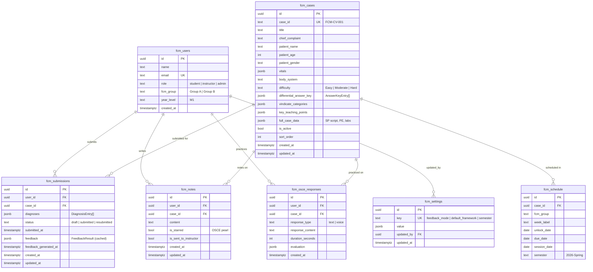

# FCM Companion — System Architecture

**Version:** v1.0
**Date:** February 18, 2026
**Live URL:** https://fcm-companion.vercel.app
**Repo:** [uva-medical-design/fcm-companion](https://github.com/uva-medical-design/fcm-companion)

---

## High-Level System Overview

```mermaid
graph TB
    subgraph Clients["Client Layer"]
        SA["Student App<br/>(Mobile-first PWA)"]
        FD["Faculty Dashboard<br/>(Desktop)"]
        AP["Admin Panel<br/>(Desktop)"]
    end

    subgraph Vercel["Vercel (Next.js 16)"]
        SSR["SSR / Static Pages"]
        API["API Routes<br/>(Serverless Functions)"]
    end

    subgraph External["External Services"]
        SB["Supabase<br/>(PostgreSQL + RLS)"]
        AI["Anthropic API<br/>(claude-sonnet-4-5)"]
    end

    SA -->|HTTPS| SSR
    FD -->|HTTPS| SSR
    AP -->|HTTPS| SSR

    SA -->|Direct queries<br/>(anon key)| SB
    FD -->|Direct queries<br/>(anon key)| SB
    AP -->|Direct queries<br/>(anon key)| SB

    SA -->|POST| API
    FD -->|GET| API

    API -->|Service role key| SB
    API -->|Generate feedback<br/>& OSCE eval| AI
```

---

## Technology Stack


---

## Route Architecture


---

## Database Schema (Entity Relationship)



---

## AI Feedback Pipeline ("Family Feud Reveal")


### Answer Key Entry Structure

```json
{
  "diagnosis": "Acute Coronary Syndrome",
  "tier": "most_likely",
  "vindicate_category": "V",
  "is_common": true,
  "is_cant_miss": true,
  "aliases": ["ACS", "MI", "heart attack", "STEMI", "NSTEMI"],
  "likelihood": "High"
}
```

### Feedback Modes (Admin-Controlled)

| Mode | Focus | AI Prompt Emphasis |
|------|-------|-------------------|
| `breadth` | VINDICATE coverage | Categories explored vs. missed |
| `cant_miss` | Dangerous diagnoses | Can't-miss diagnoses found vs. missed |
| `combined` | Both (default) | Full picture |

---

## Student Journey — Complete Data Flow


---

## Instructor Dashboard — Data Aggregation


---

## VINDICATE Framework


Internal key mapping: `V, I, N, D, I2, C, A, T, E` — the second `I` uses key `"I2"` internally but renders as `"I"` in the UI.

---

## State Management Architecture

```mermaid
graph TD
    subgraph Global["Global State"]
        LS["localStorage<br/>(fcm-user key)"]
        UC["UserContext<br/>(React Context)"]
    end

    subgraph PageState["Per-Page State (useState)"]
        CaseState["Cases: cases[], loading"]
        DiffState["Differential: diagnoses[],<br/>submission, caseData"]
        FeedState["Feedback: feedback,<br/>generating"]
        NoteState["Notes: notes[], editingNote,<br/>editContent"]
        OSCEState["OSCE: selectedCase, mode,<br/>voiceText, evaluation"]
        DashState["Dashboard: data,<br/>selectedCaseId"]
        AdminState["Admin: settings{},<br/>cases[], tab"]
    end

    subgraph Persistence["Persistence Layer"]
        Autosave["useAutosave Hook<br/>(500ms debounce)"]
        NoteDebounce["Note Save<br/>(1000ms debounce)"]
        DirectWrite["Direct Supabase<br/>Writes"]
        APIWrite["API Route<br/>Writes"]
    end

    LS <-->|mount/update| UC
    UC -->|useUser()| PageState

    DiffState --> Autosave
    NoteState --> NoteDebounce
    AdminState --> DirectWrite
    FeedState --> APIWrite
    OSCEState --> APIWrite

    Autosave -->|UPSERT| SB["Supabase"]
    NoteDebounce -->|POST /api/notes| SB
    DirectWrite --> SB
    APIWrite --> SB
```

---

## Security Model (v1 — Prototype)


### Current Limitations
- Any user can impersonate any other user via localStorage
- Anon key exposed in client — any browser can read/write all tables
- Admin operations (settings, case management) protected only by client-side role check
- No rate limiting on AI API calls

---

## Deployment Architecture


### Environment Variables

| Variable | Scope | Purpose |
|----------|-------|---------|
| `NEXT_PUBLIC_SUPABASE_URL` | Client + Server | Supabase project endpoint |
| `NEXT_PUBLIC_SUPABASE_ANON_KEY` | Client + Server | Browser-safe API key |
| `SUPABASE_SERVICE_ROLE_KEY` | Server only | Elevated access for API routes |
| `ANTHROPIC_API_KEY` | Server only | AI feedback + OSCE evaluation |

---

## Sample Case Data Structure

```mermaid
graph TD
    subgraph Case["FCM-CV-001: Chest Pain in Young Athlete"]
        CC["Chief Complaint:<br/>22yo male with chest pain"]
        Vitals["HR: 92 | BP: 128/78<br/>RR: 18 | Temp: 100.8F<br/>SpO2: 98%"]
    end

    subgraph AnswerKey["Differential Answer Key (10 diagnoses)"]
        ML["Most Likely"]
        MOD["Moderate"]
        LL["Less Likely"]
        UI["Unlikely but Important"]
    end

    subgraph MostLikely[""]
        P["Acute Pericarditis<br/>common, I category"]
        ACS["ACS ⚠️<br/>common, can't-miss, V"]
    end

    subgraph Moderate[""]
        RC["Rib Contusion<br/>common, T"]
        Cost["Costochondritis<br/>common, D"]
        Pneu["Pneumonia<br/>common, I"]
    end

    subgraph LessLikely[""]
        Myo["Myocarditis<br/>I category"]
        Pnx["Pneumothorax<br/>T category"]
    end

    subgraph UnlikelyImportant[""]
        PE["Pulmonary Embolism ⚠️<br/>can't-miss, V"]
        AD["Aortic Dissection ⚠️<br/>can't-miss, V"]
        GERD["GERD<br/>D category"]
    end

    Case --> AnswerKey
    ML --> MostLikely
    MOD --> Moderate
    LL --> LessLikely
    UI --> UnlikelyImportant
```

---

## UI Component Hierarchy


---

## Future Features & Roadmap


### Detailed Future Feature Notes

#### Near-Term (v1.1)

| Feature | Description | Complexity |
|---------|-------------|------------|
| **Real case library** | Parse 17+ cases from `~/Downloads/SMD 26 Cases and Note Templates/`. Each contains full SP script, PE findings, labs, and answer key. Populate `full_case_data` JSONB for richer OSCE simulation. | Medium |
| **Supabase Auth** | Replace roster picker with magic-link or UVA NetBadge SSO. Map `auth.uid()` to `fcm_users.id`. | Medium |
| **Row-level security** | Replace `USING (true)` with proper policies: students see only own submissions/notes, instructors see their group, admins see all. | Low |
| **Dark mode toggle** | App currently has full dark mode CSS but no manual toggle — only system preference. Add toggle in settings or header. | Low |
| **Push notifications** | "Case unlocked" and "Session tomorrow" reminders via Web Push API. | Medium |
| **Improved alias matching** | Fuzzy matching (Levenshtein distance) for diagnosis comparison instead of exact + alias matching. | Low |

#### Mid-Term (v2.0)

| Feature | Description | Complexity |
|---------|-------------|------------|
| **Case editor** | Rich form in admin panel: edit chief complaint, vitals, answer key entries (add/remove diagnoses, set tiers, manage aliases), teaching points. | High |
| **Schedule management** | Visual calendar or drag-and-drop interface for assigning cases to weeks and groups. | Medium |
| **Batch import** | Upload a CSV or JSON file of cases + answer keys. Validate format, preview, then bulk insert. | Medium |
| **Student progress** | Longitudinal view showing VINDICATE coverage improvement, can't-miss hit rate trend, cases completed. Chart.js or Recharts. | Medium |
| **Submission versioning** | Track edit history of differential submissions. Show diff between draft → submitted → resubmitted. | Medium |
| **Feedback regeneration** | Allow students to regenerate AI feedback after editing. Currently feedback is cached and never updated. | Low |
| **Export / reporting** | CSV export of all submissions, diagnoses, and feedback for research analysis. | Low |

#### Long-Term (v3.0)

| Feature | Description | Complexity |
|---------|-------------|------------|
| **Voice AI SP agent** | Real-time conversational simulation using Anthropic streaming. Student interviews a simulated patient, asks questions, receives responses based on `full_case_data`. | Very High |
| **Spaced repetition** | Adaptive review scheduling (SM-2 algorithm) for OSCE prep. Surfaces cases the student is weakest on. | Medium |
| **Peer comparison** | Anonymous benchmarking: "You covered 7/9 VINDICATE categories — the class average is 5.2." No individual identification. | Medium |
| **Illness script builder** | Structured template for building personal illness scripts per diagnosis. Links to specific cases where the diagnosis appeared. | Medium |
| **LMS integration** | Canvas LTI integration for single sign-on and optional grade passback (participation-based, not scored). | High |
| **Multi-institution** | White-label deployment for other medical schools. Configurable branding, case libraries, and frameworks (VINDICATE vs. anatomic vs. custom). | High |
| **Offline mode** | Service worker for offline access to cases, notes, and reference material. Sync when back online. | High |
| **Quote smoother** | Automatic cleanup of student quotes for journey mapping exercises — remove fillers while preserving key clinical language. (From HDS course tooling backlog.) | Medium |

---

## Data Volume Estimates

| Entity | Current (v1) | Expected (Full Semester) |
|--------|-------------|------------------------|
| Users | 10 (8 students + 2 faculty) | 50-100 per cohort |
| Cases | 3 sample | 17-25 per semester |
| Schedule entries | 6 (3 cases x 2 groups) | 50-75 |
| Submissions | 0 (fresh deploy) | 200-500 per semester |
| Notes | 0 | 100-300 |
| OSCE responses | 0 | 200-500 |
| Settings | 4 | 10-15 |

---

## Key Architectural Decisions

| Decision | Choice | Rationale | Revisit When |
|----------|--------|-----------|--------------|
| No auth | Roster picker + localStorage | Speed of prototype; FCM has no sensitive data | Before real clinical data |
| Client-side Supabase writes | Anon key direct from browser | Simpler, fewer API routes | Implementing proper auth |
| Feedback caching | Store in submission JSONB | Avoid redundant AI calls ($) | Feedback regeneration needed |
| Deterministic + AI hybrid | Compare first, narrate second | Consistent core + warm framing | Never — this is the right pattern |
| Shared Supabase instance | `fcm_` prefix tables | Reuse infrastructure | Instance limits or security needs |
| VINDICATE as default | 9 categories with I2 key | Course standard, student familiarity | Multi-institution (configurable) |
| Web Speech API | Browser-native, no cost | Good enough for prototype | Production voice features |
| Vercel deployment | Zero-config Next.js hosting | Fast, free tier sufficient | High traffic or custom domain |
